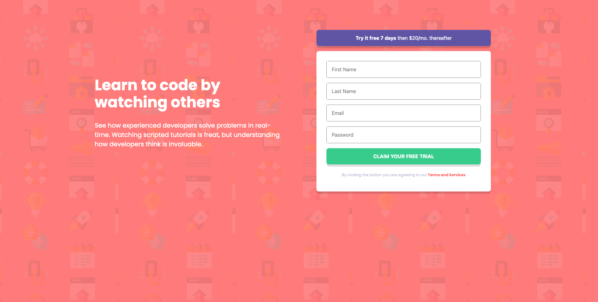

# Frontend Mentor - Intro component with sign up form solution

This is a solution to the [Intro component with sign up form challenge on Frontend Mentor](https://www.frontendmentor.io/challenges/intro-component-with-signup-form-5cf91bd49edda32581d28fd1). Frontend Mentor challenges help you improve your coding skills by building realistic projects.

## Table of contents

- [Overview](#overview)
  - [The challenge](#the-challenge)
  - [Screenshot](#screenshot)
    - [Desktop](#desktop)
    - [Mobile](#mobile)
  - [Links](#links)
- [My process](#my-process)
  - [Built with](#built-with)
  - [What I learned](#what-i-learned)
  - [Continued development](#continued-development)
  - [Useful resources](#useful-resources)
- [Author](#author)

## Overview

### The challenge

Users should be able to:

- View the optimal layout for the site depending on their device's screen size
- See hover states for all interactive elements on the page
- Receive an error message when the `form` is submitted if:
  - Any `input` field is empty. The message for this error should say *"[Field Name] cannot be empty"*
  - The email address is not formatted correctly (i.e. a correct email address should have this structure: `name@host.tld`). The message for this error should say *"Looks like this is not an email"*

### Screenshot

## Desktop

## Mobile

### Links

- Solution URL: [Add solution URL here](https://github.com/alex-castelo/frontend-mentor-intro-component-with-signup-form)
- Live Site URL: [Add live site URL here](https://alex-castelo.github.io/frontend-mentor-intro-component-with-signup-form/)

## My process

### Built with

- Semantic HTML5 markup
- CSS custom properties
- Flexbox
- Mobile-first workflow
- JavaScript
- Vite as a bundler and dev server

### What I learned

The intention with the most basic exercises is to perform it without any framework. I have the feeling that many times I learn a framework without fully understanding how things really work.

That's why I have chosen to do it with HTML, CSS and JS in order to be able to:

- interact with the DOM
- manage a form purely with these elements and without any external library or dependency.
  - Besides I have chosen Vite for the development because I was curious to try it.

### Continued development

I think the error feedback could be improved. Try to make somehow more interactive the validation of the form, so that you don't have to click on submit for validation but it would be instantaneous (with a blur, as an event trigger for example).

We could also surely implement some basic tests to see that our JS code works as expected with Vitest for example.

We could implement some E2E tests with Cypress to see how our implementation works from a user's point of view.

### Useful resources

- [Vite](https://vitejs.dev/guide/#trying-vite-online) - This has served me as a dev server with its Hot Module Replacement for example.

## Author

- Frontend Mentor - [@alex-castelo](https://www.frontendmentor.io/profile/alex-castelo)
- Twitter - [@jove_nai](https://twitter.com/jove_nai)
